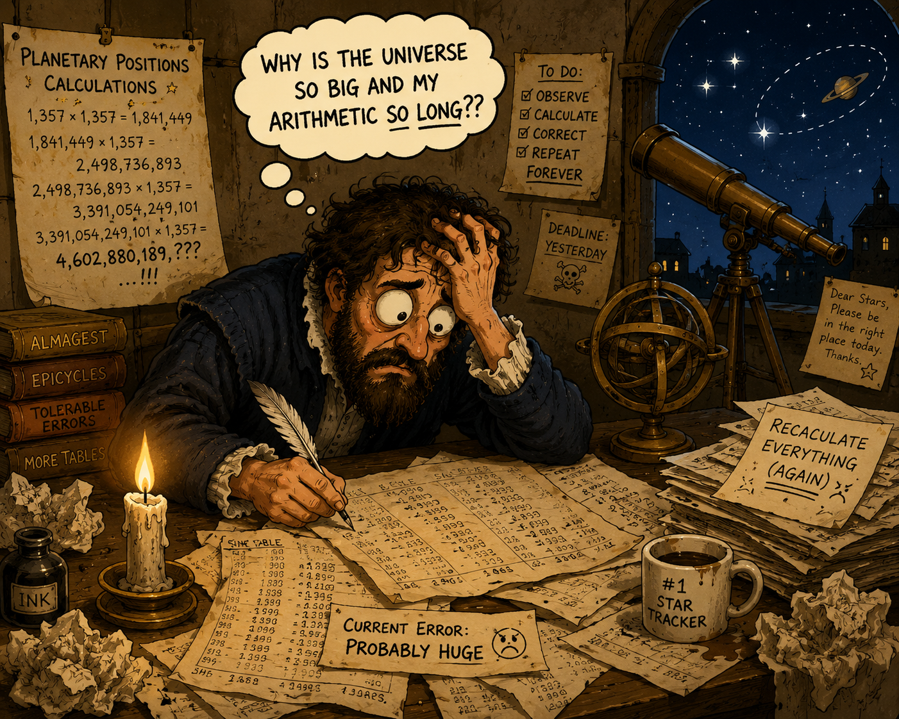
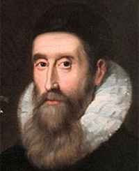
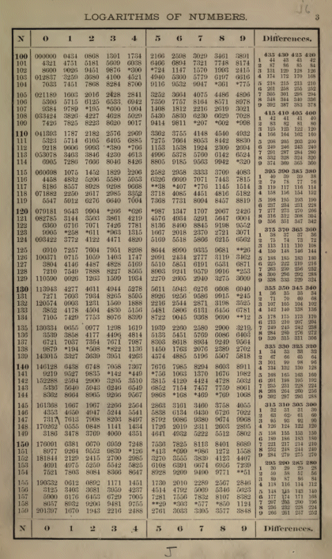
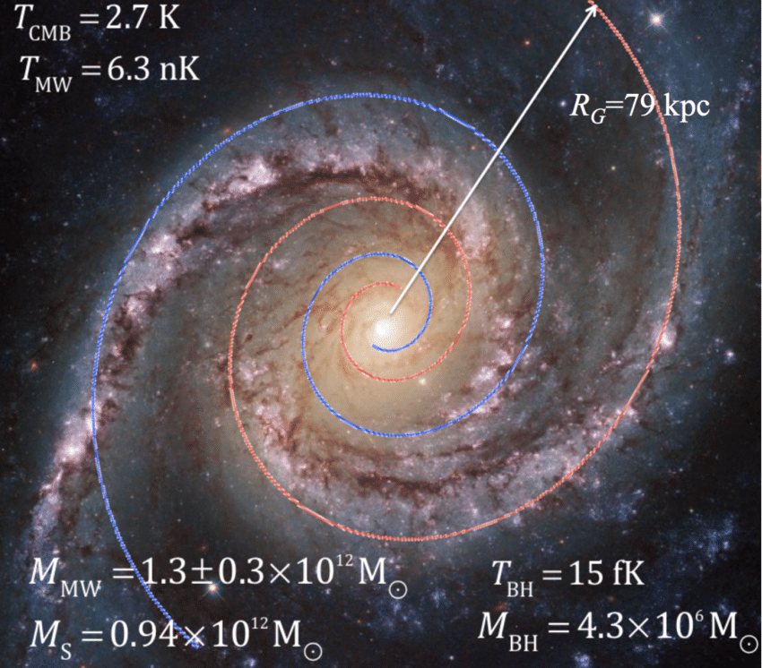

# Introduction

## A Number Nobody Was Looking For

Let us begin with a question:

**What do astronomy, banking, calculus, radioactive decay, and population growth have in common?**

Most people would probably answer:

> “Common? They all make me want to take a nap?”

Fair enough. That is not entirely wrong. But a mathematician would give something else:

> They all eventually lead to the same number: $e \approx 2.71828$

$e$ is a weird number.

Unlike $\pi$, which arrives with circles and geometry, $e$ is much harder to recognize. There is no obvious shape associated with it, no famous theorem named after it, and no simple visual interpretation that makes it instantly memorable.

In fact, nobody was deliberately searching for it.

$e$ emerged gradually from a collection of seemingly unrelated problems—astronomical calculations, logarithms, compound interest, and eventually calculus itself. Only later did mathematicians realize that all of these paths were leading to the same destination.

That realization is what makes the history of $e$ feel like a mathematical detective story: **The clues appeared first. The number came later.**

# Astronomers Were Drowning in Arithmetic

Long before anyone recognized the number $e$, astronomers were struggling with a much more immediate problem: calculation.

Modern astronomy sounds exciting—stars, planets, galaxies, and the mysteries of the universe. But for astronomers in the sixteenth and seventeenth centuries, much of the work involved pages upon pages of arithmetic. Predicting planetary motion, constructing calendars, and navigating across oceans all required enormous amounts of multiplication and division.

{fig-align="center" width="372"}

Without calculators or computers, these computations were slow, tedious, and prone to error. A small mistake could ruin an astronomical prediction or send a ship off course. As a result, mathematicians began searching for faster and more reliable ways to calculate.

This led mathematicians to a practical question:

> **Could multiplication somehow be turned into something easier?**

The idea sounds simple, but its consequences were revolutionary.

# John Napier's Shortcut

## Turning Multiplication into Addition

> Seeing there is nothing that is so troublesome to mathematical practice, nor that doth more molest and hinder calculators, than the multiplications, divisions, square and cubical extractions of great numbers. . . . I began therefore to consider in my mind by what certain and ready art I might remove those hindrances *-John Napier (1614)*

The Scottish mathematician **John Napier** took up this challenge. Born near Edinburgh in 1550, Napier was not a professional scientist in the modern sense but a scholar and landowner with a deep interest in mathematics. As astronomical observations became increasingly precise and scientific calculations grew ever more demanding, he became fascinated by the enormous amount of arithmetic required to support them.

{fig-align="center"}

Determined to reduce this burden, Napier devoted nearly twenty years to develop a new computational method. His efforts culminated in the publication of logarithms in 1614—an invention that transformed scientific calculation for centuries.

Today, logarithms are usually introduced through exponents. Although Napier's original construction was quite different, it embodied the same fundamental idea: **turning multiplication into addition.**

For modern readers, this idea is most easily understood through exponents. Consider the familiar law

$$
10^a \times 10^b = 10^{a+b}
$$

The equation shows that multiplication can be encoded as addition when numbers are represented through exponents. Logarithms capture this relationship through the identity

$$
\log(ab)=\log(a)+\log(b).
$$

This formula may appear routine for modern readers. In the seventeenth century, however, it offered a completely new way to think about calculation. Multiplications that once required substantial effort could now be reduced to additions, dramatically decreasing both the time required and the likelihood of error. In principle, astronomers no longer needed to multiply enormous numbers directly; they only needed to add their logarithms.

::: {.callout-tip collapse="true"}
## Behind the Scenes: Napier's Original Logarithms

The logarithms introduced by Napier were quite different from the ones taught today.

Modern logarithms are usually defined through exponents. For example,

$$
10^2 = 100
\qquad\Longrightarrow\qquad
\log_{10}(100)=2.
$$

Napier did not think about logarithms this way. Instead, he imagined a race between two moving particles.

One particle moves along a straight line at a constant speed. The other starts with the same speed but slows down in proportion to the distance it still has left to travel.

If the second particle's remaining distances are

$$
100,\quad 90,\quad 81,\quad 72.9,\quad \cdots
$$

then the first particle might travel

$$
0,\quad 1,\quad 2,\quad 3,\quad \cdots
$$

units during the same time intervals.

Use the slider below to move through the race step by step.

```{python}
#| echo: false
#| fig-cap: "Napier's two-particle race"
#| fig-width: 10
#| fig-height: 4.5

import numpy as np
import plotly.graph_objects as go

times = np.arange(0, 11)
particle_a = times.astype(float)
particle_b_remaining = 100 * (0.9 ** times)
particle_b_travel = 100 - particle_b_remaining
particle_b_speed = 0.1 * particle_b_remaining

def make_layout(tick_step):
    return go.Layout(
        title=dict(text="Napier's Two-Particle Race", x=0.5, font=dict(size=24)),
        margin=dict(l=30, r=30, t=70, b=45),
        width=1000,
        height=520,
        xaxis=dict(range=[-5, 105], showgrid=False, zeroline=False, title="Distance"),
        yaxis=dict(
            range=[-0.05, 2.65],
            showgrid=False,
            zeroline=False,
            tickmode="array",
            tickvals=[0.25, 1, 2],
            ticktext=["Speed of B", "Particle B", "Particle A"],
        ),
        annotations=[
            dict(x=101, y=2, text="∞", showarrow=False, font=dict(color="#2563eb", size=18)),
            dict(x=101, y=1, text="100", showarrow=False, font=dict(color="#dc2626", size=18)),
            dict(
                x=52,
                y=0.25,
                text="speed of B = 0.1 × remaining distance",
                showarrow=False,
                font=dict(color="#7f1d1d", size=15),
            ),
        ],
        updatemenus=[
            dict(
                type="buttons",
                direction="left",
                showactive=False,
                x=0.08,
                y=1.18,
                buttons=[
                    dict(
                        label="Play",
                        method="animate",
                        args=[None, dict(frame=dict(duration=250, redraw=True), fromcurrent=True, transition=dict(duration=0))],
                    ),
                    dict(
                        label="Pause",
                        method="animate",
                        args=[[None], dict(frame=dict(duration=0, redraw=False), mode="immediate", transition=dict(duration=0))],
                    ),
                ],
            )
        ],
        sliders=[
            dict(
                active=0,
                currentvalue=dict(prefix="Time t = "),
                pad=dict(t=30),
                steps=[
                    dict(
                        method="animate",
                        label=str(t),
                        args=[[str(t)], dict(mode="immediate", frame=dict(duration=250, redraw=True), transition=dict(duration=0))],
                    )
                    for t in times
                ],
            )
        ],
    )

fig = go.Figure(
    data=[
        go.Scatter(
            x=[0, 100],
            y=[2, 2],
            mode="lines",
            line=dict(color="#2563eb", width=5),
            hoverinfo="skip",
            showlegend=False,
        ),
        go.Scatter(
            x=[0],
            y=[2],
            mode="markers+text",
            text=["0"],
            textposition="top center",
            marker=dict(size=14, color="#2563eb"),
            hovertemplate="Particle A<br>time %{text}<extra></extra>",
            showlegend=False,
        ),
        go.Scatter(
            x=[0, 100],
            y=[1, 1],
            mode="lines",
            line=dict(color="#dc2626", width=5),
            hoverinfo="skip",
            showlegend=False,
        ),
        go.Scatter(
            x=[0],
            y=[1],
            mode="markers+text",
            text=["0"],
            textposition="bottom center",
            marker=dict(size=14, color="#dc2626"),
            customdata=[[100]],
            hovertemplate="Particle B<br>traveled %{text}<br>remaining %{customdata[0]:.1f}<extra></extra>",
            showlegend=False,
        ),
        go.Scatter(
            x=[0, particle_b_speed[0]],
            y=[0.25, 0.25],
            mode="lines",
            line=dict(color="#7f1d1d", width=12),
            hoverinfo="skip",
            showlegend=False,
        ),
        go.Scatter(
            x=[particle_b_speed[0]],
            y=[0.25],
            mode="markers+text",
            text=[f"v = {particle_b_speed[0]:.1f}"],
            textposition="bottom center",
            marker=dict(size=12, color="#7f1d1d"),
            hovertemplate="Particle B speed<br>%{text}<extra></extra>",
            showlegend=False,
        ),
    ],
    frames=[
        go.Frame(
            name=str(t),
            data=[
                go.Scatter(x=[particle_a[i]], y=[2], text=[f"{t}"], marker=dict(size=14, color="#2563eb")),
                go.Scatter(
                    x=[particle_b_travel[i]],
                    y=[1],
                    text=[f"{particle_b_travel[i]:.1f}"],
                    marker=dict(size=14, color="#dc2626"),
                    customdata=[[particle_b_remaining[i]]],
                ),
                go.Scatter(x=[0, particle_b_speed[i]], y=[0.25, 0.25]),
                go.Scatter(
                    x=[particle_b_speed[i]],
                    y=[0.25],
                    text=[f"v = {particle_b_speed[i]:.1f}"],
                    marker=dict(size=12, color="#7f1d1d"),
                ),
            ],
            traces=[1, 3, 4, 5],
        )
        for i, t in enumerate(times)
    ],
)

fig.update_layout(make_layout(0))
fig
```

Look at the two sequences side by side:

Every time Particle B's row moves to the next entry, it does so by multiplying by the same factor, $0.9$. Every time Particle A's row moves to the next entry, it does so by adding the same amount, $1$. That's the entire trick sitting in front of you: a table where multiplying on one side lines up with adding on the other.

Napier's move was to name Particle A's number "the logarithm of" Particle B's number at that same instant. So in his terms, the logarithm of 90 is 1, the logarithm of 81 is 2, and so on. Notice that $81 = 90 \times 0.9$ — one multiplication on B's side — and its logarithm, 2, is exactly $1+1$ — one addition on A's side. That's not a coincidence; it's forced by construction, since every step down for B is the same step up for A. This is precisely the mechanism behind $\log(ab)=\log(a)+\log(b)$: combine two numbers by multiplying, and their logarithms combine by adding, because that's how the two particles were built to move in the first place.
:::

## Briggs and the Decimal Revolution

Napier's invention attracted immediate attention across Europe. Among the mathematicians who studied it most closely was the English mathematician **Henry Briggs**.

Briggs realized that logarithms would be even more practical if they were built around powers of ten. Because everyday arithmetic already used the decimal system, base-10 logarithms were easier to compute and easier to use. Working closely with Napier, Briggs developed extensive decimal logarithm tables that quickly became the standard throughout Europe.

{fig-align="center" width="322"}

The process of using a logarithm table was straightforward:

- Look up the logarithms of the specific numbers being multiplied.

- Add these logarithmic values together.

- Perform a reverse lookup in the table to translate the sum back into the final result.

For scientists of the seventeenth century, these tables were revolutionary. Astronomers, navigators, surveyors, and engineers relied on them to perform calculations that would otherwise have required enormous effort.

Yet the success of base 10 raised a subtle question. If logarithms could be built from powers of ten, could they also be built from other bases? And if so, was there a base that was mathematically more natural than the others?

At the time, nobody knew the answer.

# Bernoulli's Question

For decades, Napier's clue remained hidden. His computation scheme had transformed calculation, but no one recognized that they contained a deeper mathematical constant.

Then the trail resurfaced in an unexpected place. Not in astronomy, navigation, or geometry, but in a question that concerned merchants and bankers alike: how does money grow when interest is compounded again and again?

## Can A Bank Account Grow Forever?

By the late seventeenth century, compound interest had become an important practical problem for merchants, lenders, and bankers. As financial transactions grew more sophisticated, mathematicians became increasingly interested in understanding how investments behaved over long periods of time.

Among them was **Jacob Bernoulli**. He was interested in a question about compound interest: If money earns interest not just once per year, but repeatedly throughout the year, how much can an investment ultimately grow?

To explore the question, he began with a simple example.

Suppose you have one unit of currency invested, earning a highly generous 100% annual interest rate. Instead of receiving the entire 100% at the end of the year, imagine the interest is split equally among $n$ compounding periods. Each period then contributes a rate of $\frac{1}{n}$, so the account is multiplied by $1+\frac{1}{n}$ each time. After $n$ such periods, the final amount becomes

$$
\left(1+\frac{1}{n}\right)^n
$$

As Bernoulli pushed the compounding frequency higher, a clear pattern emerged:

| Compounding Frequency | Formula               | Final Amount |
|-----------------------|-----------------------|--------------|
| Annually ($n = 1$)    | $(1 + 1/1)^1$         | 2.00000      |
| Quarterly ($n = 4$)   | $(1 + 1/4)^4$         | 2.44141      |
| Monthly ($n = 12$)    | $(1 + 1/12)^{12}$     | 2.61303      |
| Weekly ($n = 52$)     | $(1 + 1/52)^{52}$     | 2.69260      |
| Daily ($n = 365$)     | $(1 + 1/365)^{365}$   | 2.71457      |
| Hourly ($n = 8760$)   | $(1 + 1/8760)^{8760}$ | 2.71813      |

## A Pure Number Appears

Bernoulli noticed a profound paradox. Increasing the compounding frequency certainly increases the final amount. However, each increase contributes less than the one before it. The gains keep accumulating, yet they do so at a diminishing rate.

This raises a natural question:

> Is there an ultimate limit to how much extra growth can be squeezed out of compounding?

As the number of compounding periods grows without bound, the expression

$$
\left(1+\frac{1}{n}\right)^n
$$

approaches a specific number:

$$
2.71828\ldots
$$

Bernoulli had uncovered something unexpected. A problem about compound interest seemed to be approaching a specific numerical limit, one that did not depend on any particular bank, currency, or investment. The result looked less like a fact about finance and more like a property of mathematics itself.

Yet its significance remained unclear. Bernoulli had found the number, but not its place in the larger mathematical landscape. That connection would only become visible later.

# Euler Connects the Dots

Bernoulli had put a number to the paradox, but he had no way of knowing where else it might turn up. His limit was a fact about compound interest, sitting by itself, disconnected from everything else in this story. It would take **Leonhard Euler**, working nearly half a century later, to show that the very same constant had been hiding inside logarithms all along — not the base-10 logarithms of Briggs's tables, but a base nobody had thought to ask about.

To see how Euler got there, we have to go back to where this all started: Napier's logarithms, and the question of what a "base" even is.

## A Different Base

By the eighteenth century, logarithms had become indispensable scientific tools. Briggs's base-10 tables were used throughout Europe, and for practical computation there seemed to be little reason to prefer any other system.

Yet mathematicians knew that logarithms could be constructed using many different bases. For example, $\log_{10}(100)=2$ simply means that $10^2=100$. But there is nothing inherently special about the number 10. It is the base we use because our number system is decimal. Other bases work just as well:

$$
\log_2(2^3)=3,
\qquad
\log_3(3^4)=4.
$$

Napier and Briggs had built logarithms as a computational tool — a table you looked things up in. Back then, nobody was asking whether one base was more "correct" than another, because a table doesn't have a "base" in any deep sense; it's just a table. That question only became possible once mathematicians made a conceptual shift, treating logarithms not as tables to look things up in, but as *functions* that could be differentiated and integrated like any other.

## Euler's Bigger Project

That shift had already begun before Euler arrived on the scene. In 1697, **Johann Bernoulli** — Jacob's younger brother — started developing what he called a calculus of exponential functions, studying expressions like $a^x$ using the new tools of differentiation and integration. Logarithms, in this view, were simply the inverse of exponential: if $a^y=x$, then $y$ is the logarithm of $x$ to base $a$.

Then, **Leonhard Euler** picked up this thread in the 1720s and 1730s as part of a much larger ambition: to put the whole of algebra and calculus — powers, logarithms, exponential, trigonometry — on one unified, systematic footing. This project would eventually culminate in his 1748 textbook, the *Introductio in Analysin Infinitorum*.

{fig-align="center" width="283"}

It was while working through exponential functions in this broader context, not while chasing a single isolated riddle, that Euler ran into the question left dangling since Napier's research:

> If a logarithm is really just the inverse of an exponential function, is there a base whose exponential function behaves most simply under calculus?

## The Constant Reappears

To compare bases, Euler looked at how $a^x$ changes. Differentiating it produces the exponential function back again, multiplied by a leftover constant that depends on the base:

$$
\frac{d}{dx}a^x=\lim_{h\to 0}\frac{a^h-1}{h}\cdot a^x
$$

For most bases this limit is an unremarkable, forgettable number. Euler wanted to know: is there a number $a$ for which the limit simply equals 1 — a base whose exponential function is its own derivative?

Working out which number satisfies this condition led straight back to an old acquaintance. The value turned out to be exactly the limit Jacob Bernoulli had run into decades earlier while compounding interest:

$$
e=\lim_{h\to 0}\left(1+h\right)^{\frac1h}=\lim_{n\to\infty}\left(1+\frac1n\right)^n\approx 2.71828\ldots
$$

The slider below shows the special property of $e^x$: its slope at any point is equal to its height at that point. The red line is the tangent line, and the blue curve is $e^x$. The slope of the tangent line is always equal to the value of the function itself.

```{python}
#| echo: false
import numpy as np
import plotly.graph_objects as go

# fixed curve: y = e^x
x_curve = np.linspace(-2.2, 2.2, 400)
y_curve = np.exp(x_curve)

# slider values for the point on the curve
x0_values = np.round(np.arange(-2.0, 2.01, 0.05), 2)

def tangent_line(x0, x_range):
    y0 = np.exp(x0)
    slope = y0  # derivative of e^x at x0 is e^x0, same as y0
    return y0 + slope * (x_range - x0)

x_tangent_range = np.linspace(-2.2, 2.2, 50)

def info_annotation(x0, y0, slope):
    return dict(
        x=0.02,
        y=0.95,
        xref="paper",
        yref="paper",
        align="left",
        showarrow=False,
        bordercolor="#1d4ed8",
        borderwidth=1.5,
        borderpad=8,
        bgcolor="rgba(255,255,255,0.9)",
        font=dict(size=15),
        text=(
            f"x = {x0:.2f}<br>"
            f"y = e<sup>x</sup> = {y0:.4f}<br>"
            f"slope = {slope:.4f}<br>"
            "<b>slope and y are always equal</b>"
        )
    )

fig = go.Figure()

# the e^x curve, fixed
fig.add_trace(
    go.Scatter(
        x=x_curve,
        y=y_curve,
        mode="lines",
        name="e<sup>x</sup>",
        line=dict(width=4, color="#1d4ed8")
    )
)

# initial tangent line
x0_init = 0.0
y0_init = np.exp(x0_init)
tangent_init = tangent_line(x0_init, x_tangent_range)

fig.add_trace(
    go.Scatter(
        x=x_tangent_range,
        y=tangent_init,
        mode="lines",
        name="Tangent line",
        line=dict(dash="dash", width=3, color="#dc2626")
    )
)

# moving point
fig.add_trace(
    go.Scatter(
        x=[x0_init],
        y=[y0_init],
        mode="markers",
        name="Point on curve",
        marker=dict(size=12, color="#dc2626")
    )
)

steps = []
for x0 in x0_values:
    y0 = np.exp(x0)
    tangent = tangent_line(x0, x_tangent_range)
    step = dict(
        method="update",
        args=[
            {"x": [x_curve, x_tangent_range, [x0]],
             "y": [y_curve, tangent, [y0]]},
            {"annotations": [info_annotation(x0, y0, y0)],
             "title": "The slope of e<sup>x</sup> always equals its height"}
        ],
        label=f"{x0:.2f}"
    )
    steps.append(step)

fig.update_layout(
    title="The slope of e<sup>x</sup> always equals its height",
    width=900,
    height=600,
    xaxis_title="x",
    yaxis_title="y",
    yaxis_range=[-1, 10],
    annotations=[info_annotation(x0_init, y0_init, y0_init)],
    sliders=[
        dict(
            active=int(np.argmin(np.abs(x0_values - x0_init))),
            currentvalue={"prefix": "x = "},
            pad={"t": 40},
            steps=steps
        )
    ]
)

fig.show()
```

Bernoulli had been asking a question about money. Euler was asking a question about calculus. Both roads ended at the same number.

## One Number, Two Faces

Euler didn't stop at the limit. A limit is easy to state but slow to compute — plugging in a huge $n$ only ever gives an approximation. So Euler also worked out a second way to express the same constant, as an infinite sum:

$$
e=1+\frac1{1!}+\frac1{2!}+\frac1{3!}+\cdots
$$

This series converges quickly — a handful of terms already nails down several decimal places — which made it far more useful for actual calculation than the original limit. More importantly, Euler showed that the limit and the series were two descriptions of the very same number. Bernoulli's compound-interest problem and this new infinite sum were not just similar; they were identical.

::: {.callout-tip collapse="true"}
## Fun Fact: Why Is It Called $e$?

There is a persistent myth that Euler named the constant after himself. If true, it would be one of the boldest branding decisions in mathematical history.

Fortunately for Euler's reputation, historians consider this unlikely.

The letter $e$ was already being used by Euler in the 1730s, and the most popular explanation is surprisingly mundane: he had already used $a$ for another quantity and simply chose the next convenient vowel. Some have suggested that $e$ might stand for *exponential*, but there is little evidence that this was Euler's intention.

In fact, the number had been written using other symbols before Euler adopted $e$. What made the notation stick was not a grand naming ceremony—it was simply that Euler used it, and when the most influential mathematician in Europe writes something often enough, everyone else tends to follow.

Whatever the reason, Euler's notation survived. Three centuries later, millions of students still write the same letter.
:::

## The Natural Logarithm Finds Its Base

There is still one loose thread from the story so far. Decades before Euler pinned down $e$, a completely different logarithm had already turned up — not from exponentials at all, but from computing an area under a curve, with no base ever attached to it. This section ties that thread off: that unbased, area-defined logarithm turns out to be Euler's $e$-based $\ln$ all along.

Back in 1647, **Gregory of Saint-Vincent** had shown that the area trapped under the hyperbola $y=\frac1t$ between $t=1$ and $t=x$ behaves exactly like a logarithm: every time $x$ is *multiplied* by some factor, that area picks up the same *added* amount, no matter where you started. His student **Alphonse de Sarasa** made the connection explicit in 1649, and by 1668 **Nicholas Mercator** had a whole series for this area function. Mercator called it the **natural logarithm** — natural not because anyone knew which base it belonged to, but because it fell straight out of integration, with no arbitrary choice of 10, or 2, or anything else. For nearly a century, this "natural" logarithm sat there unbased: everyone agreed it behaved like a logarithm, but nobody could say a logarithm *of what*. This natural logarithm can be defined by the notation $A(x)$, and it has the following properties:

$$
A(x)=\int_1^x \frac{1}{t}\,dt,
\qquad
A(1)=0,
\qquad
A'(x)=\frac1x.
$$

Write $A(x) = \int_1^x \frac1t\,dt$ for this same area. The slider below shows the logarithmic behavior directly: the blue area is fixed at $A(x)$, while the red area is the extra area gained when the upper limit is multiplied by $a$ — and it always equals $A(a)$, so $A(ax) = A(x) + A(a)$.

```{python}
#| echo: false
#| fig-width: 9
#| fig-height: 5.2

import numpy as np
import plotly.graph_objects as go

x_fixed = 2.0
a_values = np.round(np.arange(1.1, 4.01, 0.1), 2)
a0 = 2.5

t_curve = np.linspace(0.65, x_fixed * a_values.max() + 0.35, 700)
y_curve = 1 / t_curve


def area_polygon(start, end, points=180):
    t = np.linspace(start, end, points)
    return np.r_[start, t, end], np.r_[0, 1 / t, 0]


def vertical_at(t):
    return [t, t], [0, 1 / t]


def title_for(a):
    return "Area Under y = 1/t"


def annotations_for(a):
    ax = x_fixed * a
    return [
        dict(
            x=0.02,
            y=1.1,
            xref="paper",
            yref="paper",
            text=(
                f"<b>x = {x_fixed:.0f}</b>, <b>a = {a:.1f}</b>, <b>ax = {ax:.1f}</b><br>"
                f"A(ax) = A(x) + A(a): "
                f"{np.log(ax):.4f} = {np.log(x_fixed):.4f} + {np.log(a):.4f}"
            ),
            showarrow=False,
            align="left",
            font=dict(size=14, color="#111827"),
        ),
        dict(
            x=1.45,
            y=0.42,
            text="A(x)",
            showarrow=False,
            font=dict(size=16, color="#1d4ed8"),
        ),
        dict(
            x=x_fixed + (ax - x_fixed) / 2,
            y=0.34,
            text="added area",
            showarrow=False,
            font=dict(size=15, color="#b91c1c"),
        ),
    ]


blue_x, blue_y = area_polygon(1, x_fixed)
red_x, red_y = area_polygon(x_fixed, x_fixed * a0)
x_line, x_line_y = vertical_at(x_fixed)
ax_line, ax_line_y = vertical_at(x_fixed * a0)

fig = go.Figure()

fig.add_trace(
    go.Scatter(
        x=t_curve,
        y=y_curve,
        mode="lines",
        name="y = 1/t",
        showlegend=False,
        line=dict(color="#111827", width=3),
        hovertemplate="t = %{x:.3f}<br>1/t = %{y:.3f}<extra></extra>",
    )
)

fig.add_trace(
    go.Scatter(
        x=blue_x,
        y=blue_y,
        mode="lines",
        fill="toself",
        name="A(x)",
        showlegend=False,
        fillcolor="rgba(37, 99, 235, 0.28)",
        line=dict(color="rgba(37, 99, 235, 0.9)", width=2),
        hovertemplate="A(x) = ln(2) = 0.6931<extra></extra>",
    )
)

fig.add_trace(
    go.Scatter(
        x=red_x,
        y=red_y,
        mode="lines",
        fill="toself",
        name="A(ax) - A(x)",
        showlegend=False,
        fillcolor="rgba(220, 38, 38, 0.25)",
        line=dict(color="rgba(185, 28, 28, 0.95)", width=2),
        hovertemplate="extra area = ln(a)<extra></extra>",
    )
)

fig.add_trace(
    go.Scatter(
        x=x_line,
        y=x_line_y,
        mode="lines+markers",
        name="x",
        showlegend=False,
        line=dict(color="#1d4ed8", width=2),
        marker=dict(size=7, color="#1d4ed8"),
        hovertemplate="x = 2<extra></extra>",
    )
)

fig.add_trace(
    go.Scatter(
        x=ax_line,
        y=ax_line_y,
        mode="lines+markers",
        name="ax",
        showlegend=False,
        line=dict(color="#b91c1c", width=2),
        marker=dict(size=7, color="#b91c1c"),
        hovertemplate="ax = %{x:.2f}<extra></extra>",
    )
)

steps = []
for a in a_values:
    red_x, red_y = area_polygon(x_fixed, x_fixed * a)
    ax_line, ax_line_y = vertical_at(x_fixed * a)

    steps.append(
        dict(
            method="update",
            label=f"{a:.1f}",
            args=[
                {
                    "x": [t_curve, blue_x, red_x, x_line, ax_line],
                    "y": [y_curve, blue_y, red_y, x_line_y, ax_line_y],
                },
                {
                    "annotations": annotations_for(a),
                },
            ],
        )
    )

fig.update_layout(
    title=title_for(a0),
    width=900,
    height=520,
    margin=dict(l=55, r=25, t=100, b=90),
    hovermode="closest",
    annotations=annotations_for(a0),
    sliders=[
        dict(
            active=int(np.argmin(np.abs(a_values - a0))),
            currentvalue=dict(prefix="Choose a = ", font=dict(size=14)),
            pad=dict(t=35),
            steps=steps,
        )
    ],
)

fig.update_xaxes(title_text="t", range=[0.65, x_fixed * a_values.max() + 0.35])
fig.update_yaxes(title_text="1/t", range=[0, 1.55])

fig
```

Multiplying the upper limit adds area, which is why this area function behaves like a logarithm.

Euler already had, from the work in the previous section, a candidate for exactly this job. He'd pinned down $e$ so that $\frac{d}{dx}e^x=e^x$, and writing $\ln x:=\log_e x$ for its inverse, that same condition translates directly into

$$
\ln 1=0, \qquad \frac{d}{dx}\ln x=
\frac1x.
$$

These are precisely the two properties that pinned down $A(x)$ back in the previous section.

Two functions, same derivative, same starting value — they have to be the same function everywhere. So Mercator's area, Euler's $\ln$, and Bernoulli's compounding limit were not three related ideas. They were one number, arrived at four separate times:

$$
\ln x=\log_e x=
\int_1^x\frac1t\,dt.
$$

The natural logarithm finally had a base. It had been $e$ the entire time.

This is the shape of the story as it is usually retold today, with the pieces arranged for clarity. Euler's actual notebooks show the ideas arriving more gradually, tangled up with his broader work on infinite series, complex numbers, and trigonometry. But the destination was the same: Napier's computational shortcut, Bernoulli's compound-interest limit, and Euler's calculus of exponentials all turned out to describe one and the same number.

For the first time, the pieces that had accumulated over more than a century finally fit together.

```{=html}
<style>
.e-timeline {
  display: grid;
  gap: 0.75rem;
  margin: 1.5rem 0;
}
.e-timeline-item {
  border-left: 4px solid #4b5563;
  background: #f8fafc;
  padding: 0.75rem 1rem;
}
.e-timeline-year {
  color: #1d4ed8;
  font-weight: 700;
}
.e-timeline-title {
  font-weight: 700;
}
</style>
```

:::::::::: e-timeline
::: e-timeline-item
[1614]{.e-timeline-year} [Napier's logarithms:]{.e-timeline-title} multiplication becomes addition.
:::

::: e-timeline-item
[1618]{.e-timeline-year} [A hidden constant:]{.e-timeline-title} early natural logarithm values begin to appear.
:::

::: e-timeline-item
[1624]{.e-timeline-year} [Briggs's base 10 tables:]{.e-timeline-title} logarithms become practical tools for calculation.
:::

::: e-timeline-item
[1683]{.e-timeline-year} [Bernoulli's compound interest limit:]{.e-timeline-title} repeated compounding points toward 2.71828...
:::

::: e-timeline-item
[1697]{.e-timeline-year} [Johann Bernoulli's exponential calculus:]{.e-timeline-title} mathematicians begin treating exponential functions as objects of calculus.
:::

::: e-timeline-item
[1727]{.e-timeline-year} [Euler's <em>e</em>:]{.e-timeline-title} the constant is tied to the unique derivative property of the exponential function.
:::

::: e-timeline-item
[1748]{.e-timeline-year} [The unification:]{.e-timeline-title} Euler connects the limit, the series, logarithms, and exponentials into one framework.
:::
::::::::::

# Why $e$ Turns Up Everywhere

As the previous section showed, $e$ is the one base whose exponential function reproduces itself under differentiation. That property is elegant on its own, but its real importance lies in what it means outside of pure mathematics: it is exactly the condition satisfied by any process whose rate of change depends on how much of it already exists.

A larger population produces more births. A larger investment earns more interest. A larger quantity of radioactive material produces more decay events. In each case, growth or decay feeds on its own current size. Calculus describes these situations using differential equations, and the solutions repeatedly involve the exponential function $e^x$.

As a result, the same number that appeared in logarithms, compound interest, and infinite series turns out to reappear throughout science — and, as the three examples below show, throughout nature itself.

## Population Growth

Imagine a colony of bacteria in a petri dish, with unlimited food and no predators in sight. Every bacterium divides in two after a fixed amount of time, so the more bacteria there are, the faster new bacteria appear.

This is the defining feature of exponential growth: the rate of increase is proportional to the current size. Mathematically, that idea is written as a simple differential equation:

$$
\frac{dP}{dt} = kP
$$

Here $P$ is the population and $k$ is the growth rate. Solving this equation gives:

$$
P(t) = P_0 \, e^{kt}
$$

where $P_0$ is the starting population. Notice that $e$ appears not because anyone inserted it by hand, but because it is the only base for which this growth pattern works out cleanly.

Of course, real populations rarely grow forever — food runs out, predators arrive, space becomes limited. But in the short term, from bacteria in a dish to rabbits in a field to cells in a growing tumor, this same exponential curve shows up again and again. Wherever "more now means more later," $e$ is quietly running the numbers.

## The 37% Rule--$e$ and the search for happiness

There is also a playful little surprise involving $e$.

In a famous problem called the **optimal stopping problem**, $e$ appears in a very unexpected way.

The basic question is this:

Suppose you must choose the best candidate from a sequence of candidates. You interview them one at a time. Once you reject someone, you cannot go back. So what is the best strategy?

A classic mathematical answer says: first, reject approximately

$$
\frac{1}{e}
$$

of the candidates. Since $\frac{1}{e} \approx 0.3679$, this means rejecting about $37\%$ of the candidates before making a serious choice — then settling for the very next one who beats everyone you've seen so far.

Therefore, when searching for a partner, the best strategy, apparently, is to reject the first $1/e$ possibilities — that is, the first 37% — and then commit to the first new candidate who is better than all the ones you turned down.

I say "apparently," because I haven't actually tried it.

## Logarithmic Spirals

There is a curve that nature seems to love, and $e$ is hiding right inside its formula.

It's called the **logarithmic spiral**, and its equation looks like this:

$$
r = a \cdot e^{b\theta}
$$

Here, $r$ is the distance from the center, $\theta$ is the angle of rotation, and $a$ and $b$ are constants that control the size and tightness of the spiral.

What makes this curve special is that it grows *exponentially* as it turns — every time it rotates by a fixed angle, it expands by the same **proportion**, not the same amount.

This self-similar growth pattern shows up again and again in the natural world:

- The chambers of a **nautilus shell**, each one a scaled-up copy of the last
- The swirling arms of a **hurricane**, viewed from above
- The sweeping arms of a **spiral galaxy**
- Even the curl of a **ram's horn** or a **fern frond** unfurling

::::: columns
::: {.column width="40%"}

:::

::: {.column width="60%"}
{width="467"}
:::
:::::

Mathematicians sometimes call it the *"spira mirabilis"* — the miraculous spiral — a name the astronomer Jacob Bernoulli gave it because he was so charmed by its self-repeating growth that he asked for it to be engraved on his tombstone.

::: {.callout-note collapse="true"}
## Nature has its preference, so do other fields

You might notice that the meaning of $\log x$ changes depending on the textbook, class, or subject. Just like nature prefers the natural logarithm, different fields have their own standard bases for logarithms:

1.  **Mathematics** (Base$e$): In pure mathematics, calculus, and analysis, $\log x$ usually means the natural logarithm ($\ln x$ or $\log_e x$). This is because $e$ is the natural base for continuous change and calculus equations.

2.  **Engineering & Physics** (Base$10$): In engineering and physics, $\log x$ typically refers to the common logarithm ($\log_{10} x$). This base is convenient for measuring quantities that span many orders of magnitude, such as decibels (sound intensity), pH (acidity), and the Richter scale (earthquakes).

3.  **Computer Science** (Base$2$): In computer science, $\log x$ (sometimes written as $\lg x$) is usually the binary logarithm ($\log_2 x$). This is because computer systems are binary (base 2), and algorithms often divide problems in half (like binary search or binary trees).

When working across disciplines, always check the convention being used, and explicitly specify the base (like $\log_2 x$ or $\ln x$) if there is any potential ambiguity.
:::

# Conclusion: The Number That Never Left

The story of $e$ did not begin with someone searching for a special constant.

Napier wanted faster calculations. Bernoulli investigated compound interest. Euler connected seemingly unrelated discoveries into a single mathematical framework.

At every turn, mathematicians pursued different problems, each following their own line of inquiry. Yet the same constant kept appearing, surfacing again and again in their results.

The journey of $e$ spans astronomy, finance, logarithms, infinite series, and calculus. What makes this remarkable is not merely that the number appears in many places, but that these appearances were discovered independently before anyone realized they were connected.

That is what makes the story of $e$ unusual. It was not invented, designed, or chosen. It revealed itself gradually, appearing wherever the mathematics of growth, change, and accumulation was pushed far enough. The number nobody was looking for had been there all along.